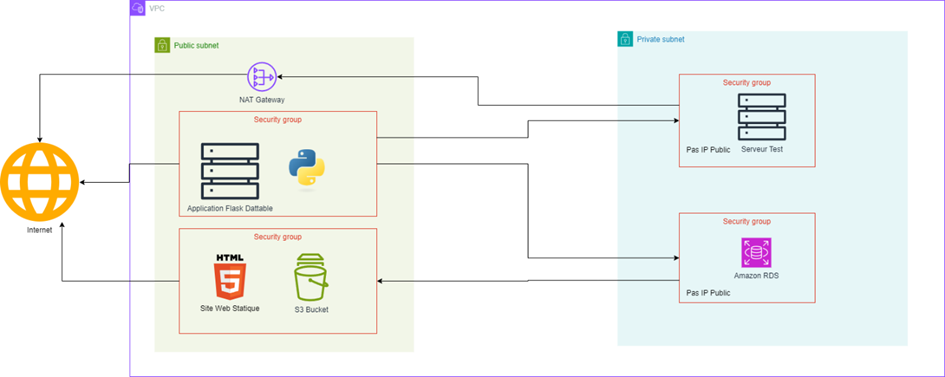

<h1> TP AWS </h1>
<h2>Schématisation de l’infrastructure : </h2>

Dans un premier temps, on remarque que par coût, notre client nous demande d’utiliser une VPC. Ici notre VPC sera disponible dans 2 zones, mais pour des questions de coût, seul la base de données sera répliquée sur 2 zones.

Sur ce schéma, on remarque donc deux subnet : un public et un privé.

Le public à un accès direct à internet et le privé doit passé par d’autres moyens pour avoir un accès extérieur.

Commençons par le sou réseau public. Dans un premier temps, on va définir nos besoins. Dans ce sous réseau, il va nous falloir un serveur avec une application qui à accès à notre base de données. Pour l’application, nous utiliserons l’application flask-datta-able, qui nécessite quelques ajustements pour fonctionner sur notre système. On a aussi besoin d’un bucket S3 afin de faire des backups de cette base de données et qui héberge un site web fixe.

Au niveau du réseau privé, nous aurons besoin d’une base de données Amazon RDS ainsi que d’un server test. Ce dernier n’aura pas d’adresse IP publique mais sera tout de même accessible via un Nate Gateway qui se trouvera dans le réseau public de notre infrastructure.

Au niveau des liaisons, le sou réseau public aura un accès internet directe. La base de données ne sera joignable que par notre serveur d’application Flasque et aura la possibilité de push sa backup directement vers notre bucket. Le serveur test quant-à-lui aura une sortie internet via sa Nat Gateway mais la connexion SSH ne se fera que via le serveur flask DattaAble ou par la suite via une autre instance (modifiable par le client à tout moment).

<h2> # I.                  Création du VPC </h2>
<h3> ## A.   Création du VPC Globale </h3>

Avant de pouvoir commencer à déployer nos serveurs, on va avoir besoin de notre VPC, qui sera notre réseau pour ce projet. 

Ici on va créer un VPC qui aura deux zones de disponibilité. Le fait qu’on ait deux zones de disponibilité est dû à la base de données qui requière une sauvegarde sur une seconde zone en cas de problématique sur l’un des serveurs sur lequel elle est hébergée.![[Pasted image 20250219160536.png]]
![[Pasted image 20250219160541.png]]
Une fois ce VPC crée, nous n’avons pas besoin d’intervenir sur la table de routage publique qui est pré configurée pour sortir via l’interface internet crée lors de la création du VPC.

<h3>## B.   Création de la NAT Gateway :</h3>

![[Pasted image 20250219160615.png]]
Ici l’on crée une passerelle Nat pour permettre à une instance située dans le réseau privé d'accéder à internet.
Modifications des routes de la table de routage privée :
![[Pasted image 20250219160641.png]]

Dans la table de routage l’on crée une route permettant d'accéder à internet grâce à la passerelle Nat.
<h2># II.                  Création des instances </h2>
<h3>## A.   Serveur Publique : </h3>
Ici pour ce serveur, nous allons créer un serveur Ubuntu 24.04.

Afin de pouvoir initier une connexion, nous lui créons aussi une clée SSH, la connectons à notre VPC, lui disons d’utiliser une adresse IP Publique et on lui crée un sécurity groupe avec l’ouverture du port 22 pour la connexion SSH et le port 8085 pour l’application.
![[Pasted image 20250219160731.png]]
![[Pasted image 20250219160739.png]]
![[Pasted image 20250219160745.png]]

Avant de valider, on peut lui ajouter un cloud init qui va permettre d’installer les packages dont nous aurons besoins telle que git, mysql et docker.
![[Pasted image 20250219160758.png]]
!!! Avant d’initier la connexion via SSH, il ne faut pas oublier de débloquer la clée SSH
Ensuite on peut git clone le projet, ce rendre dans le fichier contenant le dockercompose et faire la commande sudo docker compose up. En se connectant sur un navigateur de recherche sur l’ip suivi de :5085 on obtient cette page :
![[Pasted image 20250219160823.png]]
Avant de connecter la base de données à l’application, on peut vérifier la connexion à la bdd :
![[Pasted image 20250219160834.png]]
Et on peut vérifier la structure de notre BDD :
![[Pasted image 20250219160842.png]]
Modification du. env pour se connecter à la BDD :

![[Pasted image 20250219160853.png]]
Ici on met les debugs en false et 0. ensuite on peut entrer les informations de connexion à la base de données. 

Une fois celà fait, on peut se rendre dans le Dockerfile afin de l’optimiser un minimum et de mettre le Debug en False :

![[Pasted image 20250219160907.png]]
Dans le fichier requirement.txt, il faut retirer le # avant le flask_mysqldb.

Une fois les modifications faites, on peut refaire un conteneur et se connecter sur le site web.

Une fois ces modifications faites, on peut se rendre sur l’interface web de notre app et créer un utilisateur :
![[Pasted image 20250219160917.png]]
Et on peut retourner sur notre BDD et regarder la structure de la base de données db_bag :
![[Pasted image 20250219160926.png]]
Ainsi on voit bien que des tables se sont créées sur la base de données db_bag.
<h3> ## B.   Serveur Test : </h3>
![[Pasted image 20250219160950.png]]
![[Pasted image 20250219160955.png]]
Ici on va créer simplement une instance connectée à notre VPC privé. Ce serveur n’aura pas d’IP publique. La connexion se fera depuis le serveur public via une requête SSH.

Test de connexion : 

Dans un premier temps l’on doit se connecter au serveur test pour cela l’on doit premièrement aller se connecter sur le serveur public, une fois cela réalisé on se connecte en SSH sur notre serveur test.
![[Pasted image 20250219161024.png]]
Une fois la connexion établie, l'on lance un “sudo apt update” puis un “sudo apt upgrade” pour mettre le serveur a jour. Si c’est commande fonctionne directement alors c’est que nous sommes bel et bien connectés à internet.
![[Pasted image 20250219161033.png]]
Ici l’on peut voir que nous n’avons aucune erreur de ce fait nous sommes maintenant connectés à internet. Cependant le serveur n’est pas accessible directement via internet.
<h2> # III.                  Création de la BDD</h2>
Pour la base de données du projet, nous utilisons MySQL avec Amazon RDS. La base de données se situe sur la zone de disponibilité us-east-2b.
![[Pasted image 20250219161103.png]]
![[Pasted image 20250219161108.png]]
![[Pasted image 20250219161112.png]]
<h2> # IV.                  Création du bucket S3 </h2>
Le serveur S3 va permettre de pouvoir héberger la documentation de l’application, mais aussi de pouvoir sauvegarder les données de l’application et de la base de données.
![[Pasted image 20250219161145.png]]
![[Pasted image 20250219161148.png]]
<h2> # V.                  Connexion EC2 </h2>
Afin de pouvoir traiter la base de données à partir de l'instance publique, on configure une connexion EC2, sans cela ça ne marche pas.
![[Pasted image 20250219161209.png]]
![[Pasted image 20250219161214.png]]
![[Pasted image 20250219161217.png]]
Import d’un site statique :

A partir de l’interface de S3, on importe un site html statique afin d’avoir la documentation.
![[Pasted image 20250219161226.png]]
Hébergement de site Web statique

On active l’hébergement de site web statique afin de pouvoir héberger le site à partir de l’index qui se trouve à la racine du bucket S3.
![[Pasted image 20250219161237.png]]
On permet aussi l’accès public pour pouvoir accéder à la page.
![[Pasted image 20250219161245.png]]
La dernière étape pour rendre le site accessible est de modifier la stratégie de compartiment :
![[Pasted image 20250219161257.png]]
Le site devient donc accessible.

![[Pasted image 20250219161306.png]]

<h2> # VI.                  Sauvegarde de la base de données</h2>
Afin d’avoir une sauvegarde de la base de données, il faut créer un instantané:
![[Pasted image 20250219161337.png]]
Ensuite, on choisit “exportation vers Amazon S3” pour pouvoir l’envoyer dans le bucket.
![[Pasted image 20250219161354.png]]
![[Pasted image 20250219161358.png]]
Backup dans le bucket :![[Pasted image 20250219161409.png]]
